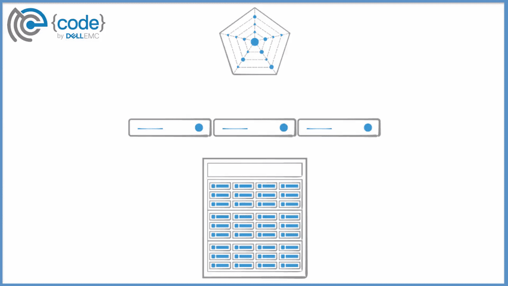

# REX-Ray

Openly serious about storage

---
REX-Ray is an open source, storage management solution designed to support
container runtimes such as Docker and Mesos. REX-Ray enables stateful
applications, such as databases, to persist and maintain its data after the life
cycle of the container has ended. Built-in high availability enables
orchestrators such as [Docker Swarm](https://docs.docker.com/engine/swarm/),
[Kubernetes](http://kubernetes.io/), and [Mesos
Frameworks](http://mesos.apache.org/) like
[Marathon](https://mesosphere.github.io/marathon/) to automatically orchestrate
storage tasks between hosts in a cluster.

Built on top of the [libStorage](http://libstorage.readthedocs.io/en/stable)
framework, REX-Ray's simplified architecture consists of a single binary and
runs as a stateless service on every host using a configuration file to
orchestrate multiple storage platforms.



!!! note "note"

    The current REX-Ray release omits support for several, previously verified
    storage platforms. These providers will be reintroduced incrementally,
    beginning with 0.4.1. If an absent driver prevents the use of REX-Ray,
    please continue to use 0.3.3 until such time the storage platform is re-
    introduced as a part of the
    [libStorage](http://libstorage.readthedocs.io/en/stable) framework.
    Instructions on how to [install](./user-guide/installation.md#rex-ray-033)
    and [configure](http://rexray.readthedocs.io/en/v0.3.3) REX-Ray 0.3.3 are
    both available.

## Supported Technologies

### Storage Provider Support
The following storage providers and platforms are supported by REX-Ray.

Provider              | Storage Platform(s)
----------------------|--------------------
Amazon EC2 | [EBS](http://libstorage.readthedocs.io/en/stable/user-guide/storage-providers#aws-ebs), [EFS](http://libstorage.readthedocs.io/en/stable/user-guide/storage-providers#aws-efs), [S3FS](http://libstorage.readthedocs.io/en/stable/user-guide/storage-providers#aws-s3fs)
Ceph | [RBD](http://libstorage.readthedocs.io/en/stable/user-guide/storage-providers#ceph-rbd)
Dell EMC | [ScaleIO](http://libstorage.readthedocs.io/en/stable/user-guide/storage-providers#dell-emc-scaleio), [Isilon](http://libstorage.readthedocs.io/en/stable/user-guide/storage-providers#dell-emc-isilon)
DigitalOcean | [Block Storage](http://libstorage.readthedocs.io/en/stable/user-guide/storage-providers#do-block-storage)
FittedCloud | [EBS Optimizer](http://libstorage.readthedocs.io/en/stable/user-guide/storage-providers/#ebs-optimizer)
Google | [GCE Persistent Disk](http://libstorage.readthedocs.io/en/stable/user-guide/storage-providers#gce-persistent-disk)
Microsoft | [Azure Unmanaged Disk](http://libstorage.readthedocs.io/en/stable/user-guide/storage-providers#azure-ud)
OpenStack | [Cinder](http://libstorage.readthedocs.io/en/stable/user-guide/storage-providers#cinder)
VirtualBox | [Virtual Media](http://libstorage.readthedocs.io/en/stable/user-guide/storage-providers#virtualbox)

### Operating System Support
The following operating systems (OS) are supported by REX-Ray:

OS             | Command Line | Service
---------------|--------------|-----------
Ubuntu 12+     | Yes          | Yes
Debian 6+      | Yes          | Yes
RedHat         | Yes          | Yes
CentOS 6+      | Yes          | Yes
CoreOS         | Yes          | Yes
TinyLinux (boot2docker)| Yes          | Yes
OS X Yosemite+ | Yes          | No
Windows        | No           | No

### Container Runtime Support
REX-Ray currently supports the following container platforms:

Platform            | Use
------------------|-------------------------
Docker            | [Volume Driver Plugin](./user-guide/schedulers.md#docker)
Mesos             | [Volume Driver Isolator module](./user-guide/schedulers.md#mesos)
Mesos + Docker    | [Volume Driver Plugin](./user-guide/schedulers.md#mesos)

### Container Orchestration Support
REX-Ray currently supports the following container orchestrators:

Orchestrator      | Container Runtime
------------------|-------------------------
Docker Swarm      | Docker
Kubernetes        | Docker
Marathon          | Docker, Mesos Containerizer

## Quick Start

### Install
The following command will download the most recent and stable build of REX-Ray
and install to `/usr/bin/rexray` on Linux systems. REX-Ray will be registered
as either a SystemD or SystemV service depending upon the OS.

```sh
$ curl -sSL https://dl.bintray.com/emccode/rexray/install | sh
```

### Configure
REX-Ray requires a configuration file for storing details used to communicate
with storage providers. This can include authentication credentials and driver-
specific configuration options.

After REX-Ray has been installed, copy and paste the contents from the
[REX-Ray Configuration Generator](http://rexrayconfig.codedellemc.com/) to a
new file on the host at `/etc/rexray/config.yml`. The configuration generator
will satisfy the majority of use cases for REX-Ray.

For more advanced and manual options, such as using multiple storage platforms,
and sample configurations of all supported storage platforms, refer to the
libStorage Storage Providers [documentation](http://libstorage.readthedocs.io/en/stable/user-guide/storage-providers/).
Additionally, look at [core properties](./user-guide/config.md#configuration-properties)
and [logging](./user-guide/config.md#logging-configuration).

#### Example
Here is a simple example for using Oracle VirtualBox:

```yaml
libstorage:
  service: virtualbox
virtualbox:
  volumePath: $HOME/VirtualBox/Volumes
```

Refer to the [VirtualBox
documentation](http://libstorage.readthedocs.io/en/stable/user-guide/storage-providers/#virtualbox)
for additional VirtualBox configuration options.

Start the VirtualBox SOAP API service using:
```sh
$ vboxwebsrv -H 0.0.0.0 -v
```

From here, REX-Ray can now be used as a command line tool. View the commands
available:

```sh
$ rexray --help
```

To verify the configuration file is working, use REX-Ray to list the volumes:

```sh
$ rexray volume ls
ID                                    Name             Status    Size
1b819454-a280-4cff-aff5-141f4e8fd154  libStorage.vmdk  attached  16
```

If there is an error, use the `-l debug` flag and consult [debugging
instructions](/#getting-help).

### Start as a Service
Container platforms rely on REX-Ray to be running as a service to function
properly. For instance, Docker communicates to the REX-Ray Volume Driver via a
UNIX socket file.

```sh
$ rexray service start
```

### Demo
View the [Vagrant Demo](./user-guide/demo/) as well as visit the [{code}
Labs](https://github.com/codedellemc/labs) for more information on ways to
setup REX-Ray and run different types of applications such as Postgres and
Minecraft.

## Getting Help
Having issues? No worries, let's figure it out together.

### Debug
The `-l debug` flag can be appended to any command in order to get verbose
output. The following command will list all of the volumes visible to REX-Ray
with debug logging enabled:

```
$ rexray volume -l debug ls
```

For an example of the full output from the above command, please refer to this
[Gist](https://gist.github.com/akutz/df2afe2dc43f75b67b8977f398095ed7).

### GitHub and Slack
If a little extra help is needed, please don't hesitate to use [GitHub
issues](https://github.com/codedellemc/rexray/issues) or join the active
conversation on the [{code} by Dell EMC Community Slack
Team](http://community.codedellemc.com/) in the #project-rexray channel
