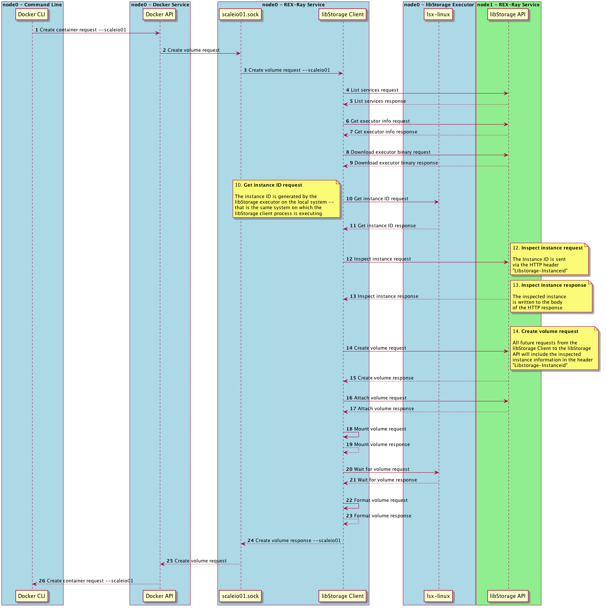

# Creating a Volume
The following example ([source](volume-create.puml)) illustrates the volume
creation workflow, beginning with Docker and including REX-Ray's Docker volume
endpoint service as well as the libStorage backend.

